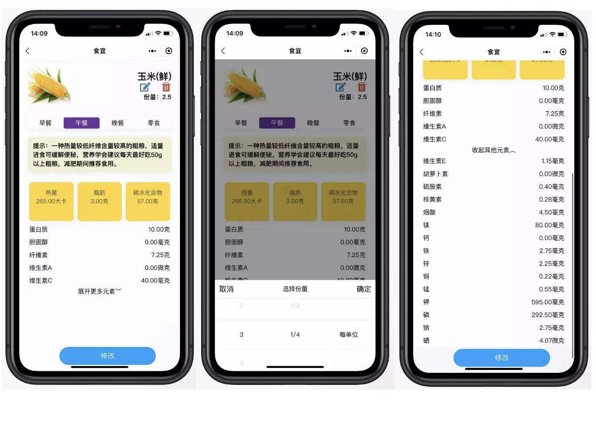

# Wechat-miniprogram-UploadHealth
 Scan this QR code with [WeChat](https://weixin.qq.com/)

In this course project for _Introduction to Software Engineering_ , we build a web application (WeChat Miniprogram) that user can: 
1. record food: what, when and how many they eat

2. add new food

3. get consumed food information in a daily, weekly or monthly review

